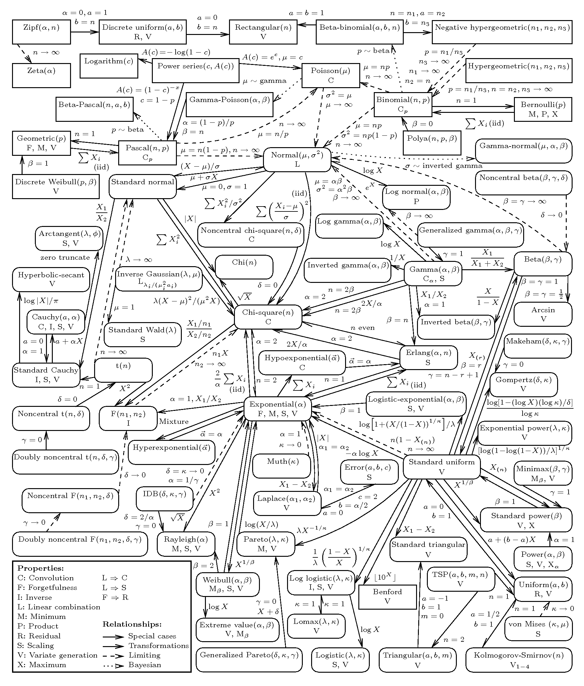

--- 
title: "RHUL Psychology\nStatistical modelling notebook"
author: "Matteo Lisi"
date: "`r Sys.Date()`"
site: bookdown::bookdown_site
documentclass: book
always_allow_html: true
bibliography: [book.bib, packages.bib]
url: https://mlisi.xyz/RHUL-stats/
cover-image: images/pop_brain.png
description: |
  Notebook for stats support activity at RHUL psych department.
biblio-style: apalike
csl: chicago-fullnote-bibliography.csl
---

# About

Placeholder


<!--chapter:end:index.Rmd-->


# Departmental survey about statistical methods {#surveys}

Placeholder


## March 2022
### Question 1
### Question 2
### Question 4
### Respondents' status

<!--chapter:end:01-surveys.Rmd-->


# Introduction to R {#intro-R}

Placeholder


## Installing R
## First steps
### Arithmetic with R
### Variable assignment
### Basic data types in R
### Vectors and other data types
### Basic plotting in R
### Other operations
#### Random number generation
### Getting help
## Resources for learning R

<!--chapter:end:02-intro-R.Rmd-->


# Linear models {#linear-models}

Placeholder


## Simple linear regression

<!--chapter:end:03-linear-models.Rmd-->


# Models for count data {#count-data}

Placeholder


## Poisson model
## Negative binomial model
## Examples 
### Anchoring and alcohol units
#### Adding predictors
#### Plotting model fit

<!--chapter:end:04-count-data.Rmd-->


# Models for ordinal data {#ordinal}

Placeholder


## Ordered logistic regression
### Mixed-effects ordinal regression

<!--chapter:end:04-ordinal.Rmd-->

```{r include=FALSE, cache=FALSE}
# example R options set globally
options(width = 60)

# example chunk options set globally
knitr::opts_chunk$set(
  comment = "#>",
  collapse = TRUE
  )

# misc
knitr::opts_chunk$set(echo = TRUE)
knitr::opts_chunk$set(cache=FALSE)
options(knitr.table.format = "html") 
```
# Meta-analyses {#meta-analysis}

For running meta-analyses, we recommend the `metafor` package for R (see [link 1](https://www.metafor-project.org/doku.php), [link 2](https://wviechtb.github.io/metafor/)).

A comprehensive, hands-on guide on how to use this package is provided in the book by Harrer and colleagues [@harrer2021doing], freely available at this [link](https://bookdown.org/MathiasHarrer/Doing_Meta_Analysis_in_R/).

An alternative to the `metafor` package is to Bayesian multilevel modelling (also discussed in the book by Harrer and colleagues). A more technical discussion of Bayesian multilevel modelling for meta-analyes is provided in [this paper](https://psyarxiv.com/7tbrm/) by Williams, Rast and Bürkner [@williams_rast_bürkner_2018].


<!--chapter:end:08-meta-analysis.Rmd-->


# Missing data {#missing-data}

Placeholder


## Types of missing data
## Deciding whether the data are MCAR
## Causal analysis and Bayesian imputation

<!--chapter:end:09-missing-data.Rmd-->


# Signal Detection Theory {#SDT}

Placeholder


## Equal-variance Gaussian SDT
### Optimal decision rule
#### Visualizing signal detection theory in R
### Estimating the parameters from data
### GLM formulation of equal-variance SDT models
## Bayesian confidence in equal-variance SDT
## Unequal-variance SDT
### Optimal confidence in unequal-variance SDT

<!--chapter:end:20-SDT.Rmd-->


# Workshops

Placeholder


## Linear multilevel models (LMM) workshop (9th Sept 2022)

<!--chapter:end:997-workshops.Rmd-->

```{r include=FALSE, cache=FALSE}
# example R options set globally
options(width = 60)

# example chunk options set globally
knitr::opts_chunk$set(
  comment = "#>",
  collapse = TRUE
  )

# misc
knitr::opts_chunk$set(echo = TRUE)
knitr::opts_chunk$set(cache=FALSE)
options(knitr.table.format = "html") 
```
# Useful links & resources

## Statistical theory

### [Map of univariate statistical distributions](http://www.math.wm.edu/~leemis/chart/UDR/UDR.html)
{width=75%}


<!--chapter:end:998-links.Rmd-->

```{r include=FALSE, cache=FALSE}
# example R options set globally
options(width = 60)

# example chunk options set globally
knitr::opts_chunk$set(
  comment = "#>",
  collapse = TRUE
  )

# misc
knitr::opts_chunk$set(echo = TRUE)
knitr::opts_chunk$set(cache=FALSE)
options(knitr.table.format = "html") 
```
`r if (knitr::is_html_output()) '
# References {-}
'`

<!--chapter:end:999-references.Rmd-->

