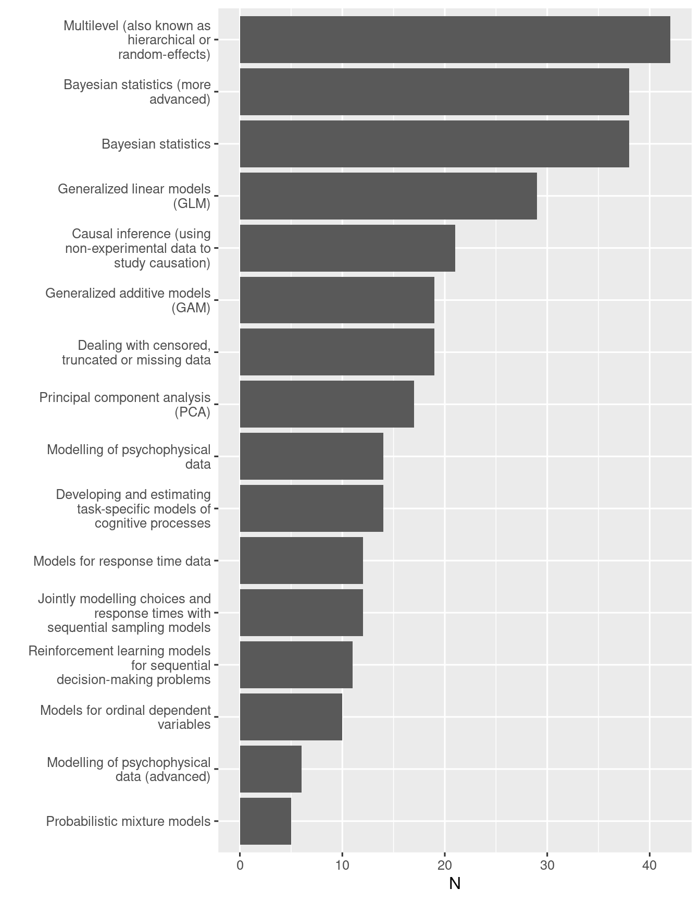
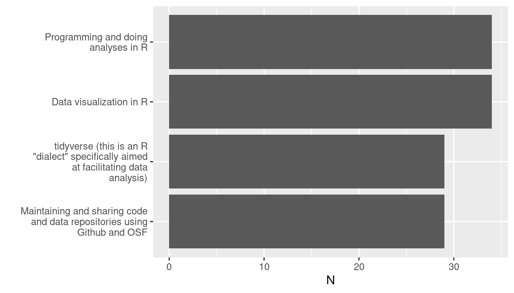

# Surveys {#surveys}

I used an anonymous survey to ask colleagues some questions about which topics may be more interesting or useful in their research. 

## March 2022

### Question 1

In the first question people indicated topics of interests. The winner are multilevel models, followed closely by Bayesian statistics.



There were some additional suggestions.


```
#> [1] "power analyses using Shiny apps"                                                         
#> [2] "agent-based models"                                                                      
#> [3] "this may be covered in the above, but approaches to analysing experience sampling method"
#> [4] "Methods for longitudinal analyses"                                                       
#> [5] "Network modelling"                                                                       
#> [6] "Neural networks, Markov processes"                                                       
#> [7] "Random forests and related"                                                              
#> [8] "causal modelling using regression models - path models etc"                              
#> [9] "prediction modelling"
```

A few other topics were mentioned in the comment section:

- Shiny apps
- Network modelling
- Longitudinal analyses
- Random forests
- Neural network


### Question 2

Here people indicated their interest for topics related to data analysis.



Other things mentioned in the comments were:

- SPM
- Docker
- Python


### Question 4

This question was about likelihood of using different formats of support


### Respondents' status

The final questions asked about the status / career level.


