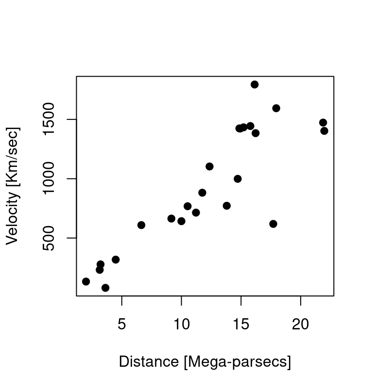

# Introduction to R {#intro-R}

Most of the practical statistical tutorials and recipes in this book use the software R, so this section provides some introduction to R for the uninitiated. 

## Installing R

The base R system can be downloaded at the following link, which provides installers for both Windows, Mac and Linux:

[https://cran.rstudio.com/](https://cran.rstudio.com/)

In addition to the base R system, it is useful to have also R-studio, which is an IDE (Integrated Development Environment) for R, and provides both an editor, a graphical interface and much more. It can be downloaded from:

[https://www.rstudio.com/products/rstudio/download/](https://www.rstudio.com/products/rstudio/download/)


## First steps

R is a programming language and free software environment for statistical computing and graphics. It is an _interpreted language_, which means that to give instructions to the computer you do not have to compile it first in machine language, everything is done 'on the fly' through a command line interpreter, e.g. if you type `2+2` in the command line R, the computer will reply with the answer (try this on your computer):

```r
2+2
#> [1] 4
```

Typically the normal workflow involve writing and saving a series of instructions in a script file, which can be executed (either step by step or all at once). This makes statistical analyses transparent and reproducible since everyone in possess of the same data and script should be able to obtain the same results.

In an R script you can use the `#` sign to add comments, so that you and others can understand what the R code is about. Comments are not run as R code, so they will not influence your result. See the next example:

```r
# calculate 3 + 4
3 + 4
#> [1] 7
```

### Arithmetic with R
In its most basic form, R can be used as a simple calculator. Consider the following arithmetic operators:

  * Addition: `+`
  * Subtraction: `-`
  * Multiplication: `*`
  * Division: `/`
  * Exponentiation: `^`
  * Modulo: `%%`

The last two might need some explaining:

The ^ operator raises the number to its left to the power of the number to its right: for example `3^2` is 9.

The modulo returns the remainder of the division of the number to the left by the number on its right, for example 5 modulo 3 (or `5 %% 3`) is 2.

**Try on your computer:**

  * Type 2^5 in the editor to calculate 2 to the power of 5.
  * Type 28 %% 6 to calculate 28 modulo 6.


### Variable assignment

A basic concept in programming (statistical or not) is called a _variable_.

A variable allows you to store a value (e.g. 2) or an object (e.g. a function description) in R. You can then later use this variable's name to easily access the value or the object that is stored within this variable.

You can assign a value `2` to a variable `my_var` with the command

```r
my_var <- 2
```

Note that you would have obtained the same result using:


```r
2 -> my_var
```

that is, the _assignment operator_ works in both directions `<-` and `->`.


The variable can then be used in any computation, for example:

```r
my_var + 2 
#> [1] 4
```

**Try on your computer:**

  * Assigns the value 42 to the variable x in the editor, then print out its value.
  * Suppose you have a fruit basket with five apples. As a data analyst, you want to store the number of apples in a variable with the name `my_apples`.
  * You decide to add six oranges to your fruit basket. Create the variable `my_oranges` and assign the value 6 to it. Next, you want to calculate how many pieces of fruit you have in total. Since you have given meaningful names to these values, you can now code this in a clear way by typing `my_apples + my_oranges`
  * Assign the result of adding `my_apples` and `my_oranges` to a new variable `my_fruit`


### Basic data types in R

Despite common knowledge we just added apples and oranges. The `my_apples` and `my_oranges` variables both contained a number (a numerical value) in the previous exercise. The `+` operator works with numeric variables in R. If you really tried to add "apples" and "oranges", and assigned a _text value_ to the variable my_oranges, you would be trying to assign the addition of a numeric and a character variable to the variable `my_fruit`. This is not possible, and R will give you an error message.


```r
# Assign a value to the variable my_apples
my_apples <- 5 

# Assign a text value
my_oranges <- "six" 

#
my_fruit <- my_apples + my_oranges 
#> Error in my_apples + my_oranges: non-numeric argument to binary operator
```


In fact R works with numerous data types, and some of these are not numerical (so they can't be added, subtracted, etc.). Some of the most basic types to get started are:

  * Decimal values like 4.5 are called numerics.
  * Natural numbers like 4 are called integers. Integers are also numerics.
  * Boolean values (`TRUE` or `FALSE`, abbreviated `T` and `F`) are called logical^[Note that you can add or multiply logical Boolean values: internally `FALSE` are treated as zeroes, and `TRUE` as ones.].
  * Text (or string) values are called characters.

**Try on your computer:**

  * Assign `my_numeric` variable to `42`.
  * Assign `my_character` variable to "universe". (Note that the quotation marks indicate that "universe" is a character.)
  * Assign `my_logical` variable to `FALSE`. (Note that R is case sensitive!)


## Using R for statistical analyses

### Example 1: _How old is the universe?_

In this example^[Taken from Simon Wood's book on GAM[@wood_gam].] we will see how to import data into R and perform a simple linear regression analysis. 

According to the standard big-bang model, the universe expands uniformly and locally, according to Hubble's law
$$
y = \beta x
$$
where $y$ and $x$ are the relative velocity and distance of a galaxy, respectively; and $\beta$ is "Hubble's constant". Note that this is a simple linear equation, in which $\beta$ indicate how much $y$ changes for each unitary increase in $x$.

According to this model $\beta^{-1}$ gives the approximate age of the universe, but $\beta$ is unknown and must somehow be estimated from observations of $y$ and $x$, made for a variety of galaxies at different distances from us. Luckily we have available data from the Hubble Space Telescope. Velocities are assessed by measuring the Doppler effect red shift in the spectrum of light that we receive from the Galaxies. Distance is estimated more indirectly, by using the discovery that in certain class of stars (Cepheids), which display fluctuations in diameter and temperature over a stable period, there is a systematic relationship between the period and their luminosity.

We can load the data in R using the following code

```r
d <- read.table("https://raw.githubusercontent.com/mattelisi/RHUL-stats/main/data/hubble.txt", header=T)
```

`read.table` is a generic function to import dataset in text files (e.g. .csv files) into R. We use the argument `header=T` to specify that the first line of the dataset gives the names of the columns. To see the help of this function, and what other arguments and features are available type `?read.table` in the R command line.

We can use the command `str()` to examine what we have imported

```r
str(d)
#> 'data.frame':	24 obs. of  3 variables:
#>  $ Galaxy  : chr  "NGC0300" "NGC0925" "NGC1326A" "NGC1365" ...
#>  $ velocity: int  133 664 1794 1594 1473 278 714 882 80 772 ...
#>  $ distance: num  2 9.16 16.14 17.95 21.88 ...
```
This tells us that our data frame has 3 variables:

- `Galaxy`, the 'names' of the galaxies in the dataset
- `velocity`, their relative velocity in Km/sec
- `distance`, their distance expressed in Mega-parsecs^[$1 \text{Mega-parsec} = 3.09 \times 10^{19} \text{Km}$]

We can plot^[See `?plot` for more info about how to customize plots in R.] them using the following code:

```r
plot(d$distance, # indicate which variable on X axis
     d$velocity, # indicate which variable on Y axis
     xlab="Distance [Mega-parsecs]",
     ylab="Velocity [Km/sec]", 
     pch=19) # set the type of point
```



It is clear, from the figure, that the observed data do not follow Hubble's law exactly, but given the how these measurements were obtained (there is uncertainty about the true values of the distance and velocities) it would be surprising if they did. Given the apparent variability, what can be inferred from these data? 
In particular:

1. what value of $\beta$ is most consistent with the data? 
2. what range of $\beta$ values is consistent with the data? 

In order to make inferences we make some assumptions about the nature of the measurement noise. Specifically, we assume that measurements errors are well-characterized by a Gaussian distribution. This result in the following model: 
\begin{align*}
y &= \beta x + \epsilon \\
\epsilon &\sim \mathcal{N} \left(0, \sigma_{\epsilon}^2 \right)
\end{align*}
which is essentially a linear regression but without the intercept.


We can fit the model with the function `lm` in R.


```r
hub.m <- lm(velocity ~ 0 + distance, d)
summary(hub.m)
#> 
#> Call:
#> lm(formula = velocity ~ 0 + distance, data = d)
#> 
#> Residuals:
#>    Min     1Q Median     3Q    Max 
#> -736.5 -132.5  -19.0  172.2  558.0 
#> 
#> Coefficients:
#>          Estimate Std. Error t value Pr(>|t|)    
#> distance   76.581      3.965   19.32 1.03e-15 ***
#> ---
#> Signif. codes:  
#> 0 '***' 0.001 '**' 0.01 '*' 0.05 '.' 0.1 ' ' 1
#> 
#> Residual standard error: 258.9 on 23 degrees of freedom
#> Multiple R-squared:  0.9419,	Adjusted R-squared:  0.9394 
#> F-statistic: 373.1 on 1 and 23 DF,  p-value: 1.032e-15
```

So, based on this data, our estimate of the Hubble constant is 76.58 with a standard error of 3.96.

::: {.rmdnote}

*So, how old?*

The Hubble constant estimate have units of $\frac{\text{Km}/\text{sec}}{\text{Mega-parsecs}}$. A Mega-parsecs is $3.09 \times 10^{19} \text{Km}$, so we divide our estimate of $\hat \beta$ by this amount. The reciprocal of $\hat \beta$ then gives the approximate age of the universe (in seconds). In R we can calculate it (in years) as follow


```r
hubble.const <- coef(hub.m)/(3.09 * 10^(19))
age <- 1/hubble.const
age/(60^2 * 24 * 365)
#>    distance 
#> 12794692825
```

giving an estimate of about 13 billion years.

:::

## Other learning resources

There is plenty of resources on the web to learn R. I will recommend a couple that I think are particularly well-done and useful:

- [Software Carpentry tutorials on R for Reproducible Scientific Analysis](https://swcarpentry.github.io/r-novice-gapminder/)
- The free book [Learning Statistics with R](https://learningstatisticswithr.com/) by [Danielle Navarro](https://djnavarro.net/)


