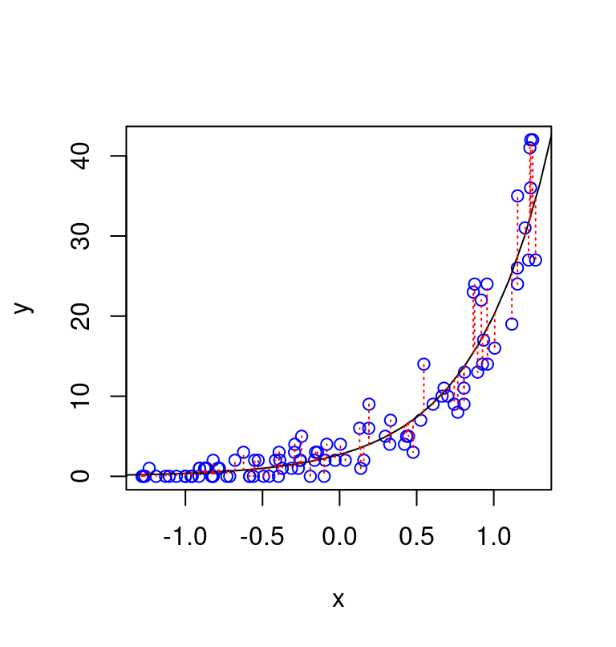
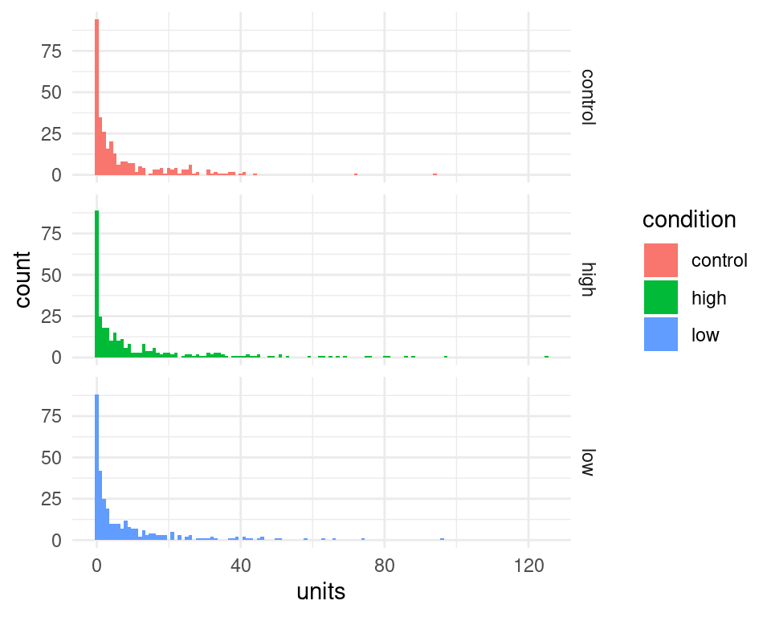
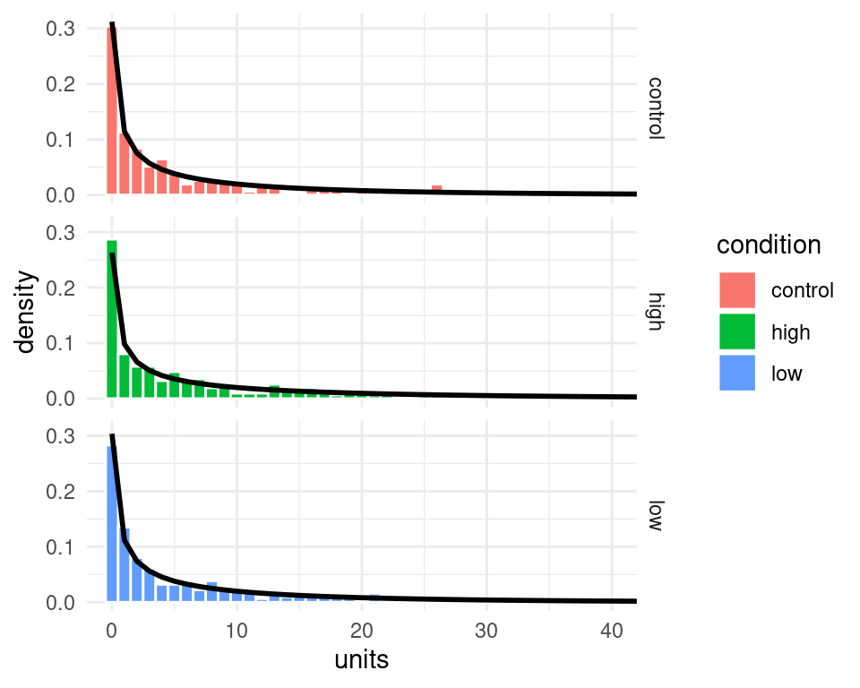
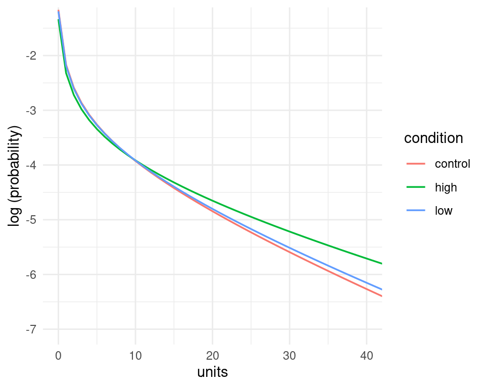

# Models for count data {#count-data}


This section will provide some examples of models that can deal with *count* data. Typically, count data occurs when the dependent variable is the counted number of occurrences of an event - for example the number of patients arriving in an emergency department (A&E) in a given time of the day - e.g. between 10:00 and 11:00. In this case, the dependent variable (the number of patients) has several characteristics that make it unsuitable for analysis with standard linear models such as linear regression: their distribution is discrete, composed only of non-negative integers, and is often positively skewed, with many observations having a value of 0. 

Another characteristic is that the variance of the observations (e.g. the variance of the number of counts across observations within the same condition) increases with their expected value (e.g. the average number of counts for that condition)^[This makes sense if you think that when the expected number of counts is very low, say $\approx 1$, there cannot be many observations with very high counts - otherwise their average wouldn't be as low (recall that counts are strictly non-negative). In other words, the variance must be low when the average is also low.].

## Poisson model

The simplest model that account for the characteristics mentioned above is a generalized linear model that assume a dependent variable with a [Poisson distribution](https://en.wikipedia.org/wiki/Poisson_distribution). The Poisson distribution has a single free parameter, usually notated with $\lambda$, which gives both the expected value (the mean) and the variance of the count variable. In fact it assumes that the variance has the same value as the mean. 

Formally, a Poisson model is usually formulated as follow: let $y=(y_1, \dots, y_n)$ be the dependent variable, consisting of counts (non-negative integers) and $x$ the independent variable (predictor). Then

$$
y_i \sim \text{Poisson} \left(\lambda_i \right)
$$
where^[This is the most common formulation, and is sometime referred to as log 'link' function, to indicate the fact that we have a function (the logarithm function) that 'link' the linear part of the model (the linear combination of the independent variables, here $\beta_0 + \beta_1 x_i$) with the parameter of the distribution of the dependent variable (here the Poisson rate parameter $\lambda$). This is a common component to all generalized linear models, for example for the logistic regression we have a 'logit' link function - the quantile function of the standard logistic distribution - that link the linear predictor part with the parameter $p$ of the binomial distribution.]
$$
\log( \lambda_i) = \beta_0 + \beta_1 x_i
$$
or alternatively 
$$
\lambda_i = e^{\beta_0 + \beta_1 x_i}
$$
Which indicates that we can use the exponential function (in R the function `exp()`) to calculate the predicted values of the mean (more precisely, the expected value, $\mathbb{E}(y)$) and variance ($Var(y)$) of the dependent variable. This relies on the property of the Poisson distribution^[The symbol $\implies$ is used to denote logical implication, e.g. $(A=B)\implies (B=A)$ - symmetry of logical equivalence.]
$$
y_i \sim \text{Poisson} \left(\lambda \right) \implies \mathbb{E}(y)=Var(y)=\lambda
$$


However, in practice, data often do not conform to the constraint of having identical mean and variance. Often the observed variance of the count is higher than what predicted according to the Poisson model (we say in this case that the data is _over-dispersed_).

::: {.rmdnote}

*How does over-dispersion look like?*

The type of data expected under a Poisson model is illustrated in the figure below, which shows 100 datapoints simulated from the model $y_i \sim \text{Poisson} \left(e^{1 + 2x_i }\right)$. The vertical deviations of the datapoints from the line are consistent with the property of the Poisson distribution that the variance of hte count has the same value as their expected value, formally, $Var(y) = \mathbb{E}(y)$).


```r
set.seed(2)
n <- 100
x <- runif(n, -1.3, 1.3)
a <- 1
b <- 2
linpred <- a + b*x # linear predictor part
y <- rpois(n, exp(linpred)) # simulate Poisson observations

plot(x,y,col="blue") # plot
x_ <- seq(-2,2,0.1)
lines(x_, exp(a+b*x_))
segments(x,exp(a+b*x),x,y, lwd=1,lty=3, col="red")
```



We can adjust the code above to simulate the same data with some degree of over-dispersion, using a negative binomial distribution, for different values of the precision parameter theta ($\theta$), which regulate the degree of overdispersion. Importantly, these datapoints are simulated assuming the same function fo the average (expected) number of counts (same also as the previous figure), they just differe in the amount of overdispersion relative to a Poissone model. Note that for value arbitrarily large of the precision parameter $\theta \rightarrow \infty$ (bottom-right panel) the negative binomial converges to the Poisson.


:::


## Negative binomial model

As mentioned above, data are often overdispersed relative to the Poisson (that is, their variance is larger than the mean). This is an issue because when the data are overdispersed then our results may be largely influences by few extreme datapoints. Moreover, we will have the wrong estimated about the variability of the data. To account for overdispersion we can use the negative binomial which can be seen as a generalization of the Poisson model^[The name _negative binomial_ comes from a sampling procedure that give rise to this distribution: basically the negative binomial gives the probability of the number of successes in a sequence of independent and identically distributed Bernoulli trials before a specified (non-random) number of failures occur (this pre-fixed number of failures is a parameter of the negative binomial under an alternative parametrization of this distribution).].

Formally, the negative binomial model with 1 predictor $x$ can be notated as
$$
\begin{aligned}
y_i & \sim \text{NegBinomial} \left(\lambda_i, \theta \right)\\
\log( \lambda_i) & = \beta_0 + \beta_1 x_i
\end{aligned}
$$

The negative binomial is very similar to the Poisson - in particular it still the case that $\mathbb{E}(y)=\lambda$. However, it includes an additional precision (or "reciprocal dispersion") parameter which I referred to as $\theta$^[I choose 'theta' for consistency with the R output but note that this is sometime referred to as $\phi$ in the literature `¯\_(ツ)_/¯` ]. Essentially, whereas for the Poisson we had that $Var(y) = \mathbb{E}(y)$, now we have that
$$
Var(y) = \mathbb{E}(y) + \frac{\mathbb{E}(y)^2}{\theta}
$$


## Examples 

### Anchoring and alcohol units

To see how this would work in practice, I use negative binomial to analyse a dataset that is based on an experiment run by Ryan McKay and his MSc students^[Note that this is not the actual dataset that they collected but just some data that I simulated based on their research idea.]. 

The goal of the study was to use the anchoring effect to:

> _...to see if we could attenuate under-reporting of alcohol consumption (which is a medical problem). Participants in a high-anchor condition were asked “do you drink more or less than 40 units of alcohol a week”, and were then asked to estimate exactly how many units they’d consumed. Those in a low anchor condition were initially asked “do you drink more or less than 4 units of alcohol a week” before giving their precise estimate, and those in a control condition just gave their precise estimate._

In R we begin by loading the data


```r
d <- read_csv("../data/nb_units.csv", show_col_types = F) # data availabel in the data folder of the repository
d
#> # A tibble: 930 × 3
#>    gender condition units
#>    <chr>  <chr>     <dbl>
#>  1 Male   high         10
#>  2 Male   low           0
#>  3 Female high          1
#>  4 Female high          2
#>  5 Male   high          0
#>  6 Female low           2
#>  7 Male   control      23
#>  8 Female low           2
#>  9 Female high          1
#> 10 Male   control       4
#> # … with 920 more rows
```

We can calculate the mean and variance of the number of units reported in each conditions. This reveal that the variance across participants in the number of units reported is many times higher than the mean in the number of reported units.


```r
d %>%
  group_by(condition) %>%
  summarise(Mean = mean(units),
            Variance = var(units)) %>%
  knitr::kable(digits=2,
               caption="Mean and Variance of weekly units of alcohol reported.")
```

<table>
<caption>(\#tab:unnamed-chunk-5)Mean and Variance of weekly units of alcohol reported.</caption>
 <thead>
  <tr>
   <th style="text-align:left;"> condition </th>
   <th style="text-align:right;"> Mean </th>
   <th style="text-align:right;"> Variance </th>
  </tr>
 </thead>
<tbody>
  <tr>
   <td style="text-align:left;"> control </td>
   <td style="text-align:right;"> 7.53 </td>
   <td style="text-align:right;"> 138.35 </td>
  </tr>
  <tr>
   <td style="text-align:left;"> high </td>
   <td style="text-align:right;"> 11.97 </td>
   <td style="text-align:right;"> 363.69 </td>
  </tr>
  <tr>
   <td style="text-align:left;"> low </td>
   <td style="text-align:right;"> 8.12 </td>
   <td style="text-align:right;"> 177.05 </td>
  </tr>
</tbody>
</table>

We can use ggplot2 library to visualize the distributions of reported units in each condition. We can see tha the distribution are skewed and contains many 0, which would make them unsuitable for an analysis with a linear regression model.


```r
d %>%
  ggplot(aes(x=units, fill=condition)) +
  geom_histogram(binwidth=1)+
  facet_grid(condition~.) +
  theme_minimal() 
```




To estimate the negative-binomial model, we can use the function `glm.nb()` from available in the `MASS` package. Our predictor condition is categorical with 3 levels and therefore it is coded internally as a set of 2 dummy variables. We can see how the contrast is set using


```r
d$condition <- factor(d$condition) # tell R that this is a categorical factor
contrasts(d$condition)
#>         high low
#> control    0   0
#> high       1   0
#> low        0   1
```

This indicate that `control` is our baseline condition and the model will have 2 coefficients that code for the difference in the `high` and `low` anchoring condition relative to the control one.

Note also that for this analysis the variable `units` must contain only integer values - if participants reported non-integer values (e.g. a bottle of lager is about 1.7 units) we could divide everything by the minimum common denominator so that we end up with integer values. 

The following command can be used to estimate the model and examine the results


```r
library(MASS)
#> 
#> Attaching package: 'MASS'
#> The following object is masked from 'package:dplyr':
#> 
#>     select
nb01 <- glm.nb(units ~ condition, data = d)
summary(nb01)
#> 
#> Call:
#> glm.nb(formula = units ~ condition, data = d, init.theta = 0.3852966632, 
#>     link = log)
#> 
#> Deviance Residuals: 
#>     Min       1Q   Median       3Q      Max  
#> -1.6347  -1.5261  -0.5620   0.1311   2.5895  
#> 
#> Coefficients:
#>               Estimate Std. Error z value Pr(>|z|)    
#> (Intercept)    2.01856    0.09396  21.482  < 2e-16 ***
#> conditionhigh  0.46365    0.13218   3.508 0.000452 ***
#> conditionlow   0.07564    0.13255   0.571 0.568251    
#> ---
#> Signif. codes:  
#> 0 '***' 0.001 '**' 0.01 '*' 0.05 '.' 0.1 ' ' 1
#> 
#> (Dispersion parameter for Negative Binomial(0.3853) family taken to be 1)
#> 
#>     Null deviance: 1040.0  on 929  degrees of freedom
#> Residual deviance: 1025.2  on 927  degrees of freedom
#> AIC: 5656.8
#> 
#> Number of Fisher Scoring iterations: 1
#> 
#> 
#>               Theta:  0.3853 
#>           Std. Err.:  0.0196 
#> 
#>  2 x log-likelihood:  -5648.7830
```

We can see from output that the condition `high` anchoring elicited reports with higher number of alcohol units than the `control` condition.

We can use the model to make a more precise statement about the size of the difference. We can use the value of the coefficients to calculate the predicted values of counts. The exact values of the coefficients can be accessed from the fitted model using the `$` operator


```r
nb01$coefficients
#>   (Intercept) conditionhigh  conditionlow 
#>    2.01856406    0.46365080    0.07563937
```

The values are combined together according to the dummy variables coding for the condition and represents the linear predictor part of the model:

$$
\lambda_i = \exp \left(\beta_0 + \beta_1\times D_\text{high}+ \beta_2\times D_\text{low} \right)
$$
where I have used the notation $D_\text{high}$ and $D_\text{low}$ to indicate the two dummy variable, whose value is 1 for observation in the `high` and `low` conditions, respectively, and zero otherwise. 

$\beta_0$ is a common notation for the intercept parameter - in this case it gives the expected number of alcohol units in the control condition (because for observations in the control condition we have that $D_\text{high}= D_\text{low}=0$). Thus our model predict an average number of counts in the control condition of 


```r
exp(nb01$coefficients["(Intercept)"]) # equivalent to exp(nb01$coefficients[1])
#> (Intercept) 
#>    7.527508
```

(Compare this value with the table above).


Furthermore, our models tells us also that the number of reported alcohol units increase multiplicatively in the `high` condition by a factor of 


```r
exp(nb01$coefficients["conditionhigh"])
#> conditionhigh 
#>      1.589868
```

In fact the predicted number of counts in the `high` condition can be derived from the model as 


```r
exp(nb01$coefficients["(Intercept)"])  * exp(nb01$coefficients["conditionhigh"]) 
#> (Intercept) 
#>    11.96774
```
 
or equivalently 
 

```r
exp(nb01$coefficients["(Intercept)"] + nb01$coefficients["conditionhigh"]) 
#> (Intercept) 
#>    11.96774
```
 
Finally, note that we can use the `sjPlot` library to prepare a fancy version of the model output, and we can see that the multiplicative factor that describe the increase in reported units is called here an _incidence ratio_^[Although honestly I am not sure how common is this terminology].


```r
library(sjPlot)
#> Install package "strengejacke" from GitHub (`devtools::install_github("strengejacke/strengejacke")`) to load all sj-packages at once!
tab_model(nb01)
```

<table style="border-collapse:collapse; border:none;">
<tr>
<th style="border-top: double; text-align:center; font-style:normal; font-weight:bold; padding:0.2cm;  text-align:left; ">&nbsp;</th>
<th colspan="3" style="border-top: double; text-align:center; font-style:normal; font-weight:bold; padding:0.2cm; ">units</th>
</tr>
<tr>
<td style=" text-align:center; border-bottom:1px solid; font-style:italic; font-weight:normal;  text-align:left; ">Predictors</td>
<td style=" text-align:center; border-bottom:1px solid; font-style:italic; font-weight:normal;  ">Incidence Rate Ratios</td>
<td style=" text-align:center; border-bottom:1px solid; font-style:italic; font-weight:normal;  ">CI</td>
<td style=" text-align:center; border-bottom:1px solid; font-style:italic; font-weight:normal;  ">p</td>
</tr>
<tr>
<td style=" padding:0.2cm; text-align:left; vertical-align:top; text-align:left; ">(Intercept)</td>
<td style=" padding:0.2cm; text-align:left; vertical-align:top; text-align:center;  ">7.53</td>
<td style=" padding:0.2cm; text-align:left; vertical-align:top; text-align:center;  ">6.29&nbsp;&ndash;&nbsp;9.10</td>
<td style=" padding:0.2cm; text-align:left; vertical-align:top; text-align:center;  "><strong>&lt;0.001</strong></td>
</tr>
<tr>
<td style=" padding:0.2cm; text-align:left; vertical-align:top; text-align:left; ">condition [high]</td>
<td style=" padding:0.2cm; text-align:left; vertical-align:top; text-align:center;  ">1.59</td>
<td style=" padding:0.2cm; text-align:left; vertical-align:top; text-align:center;  ">1.23&nbsp;&ndash;&nbsp;2.06</td>
<td style=" padding:0.2cm; text-align:left; vertical-align:top; text-align:center;  "><strong>&lt;0.001</strong></td>
</tr>
<tr>
<td style=" padding:0.2cm; text-align:left; vertical-align:top; text-align:left; ">condition [low]</td>
<td style=" padding:0.2cm; text-align:left; vertical-align:top; text-align:center;  ">1.08</td>
<td style=" padding:0.2cm; text-align:left; vertical-align:top; text-align:center;  ">0.83&nbsp;&ndash;&nbsp;1.40</td>
<td style=" padding:0.2cm; text-align:left; vertical-align:top; text-align:center;  ">0.568</td>
</tr>
<tr>
<td style=" padding:0.2cm; text-align:left; vertical-align:top; text-align:left; padding-top:0.1cm; padding-bottom:0.1cm; border-top:1px solid;">Observations</td>
<td style=" padding:0.2cm; text-align:left; vertical-align:top; padding-top:0.1cm; padding-bottom:0.1cm; text-align:left; border-top:1px solid;" colspan="3">930</td>
</tr>
<tr>
<td style=" padding:0.2cm; text-align:left; vertical-align:top; text-align:left; padding-top:0.1cm; padding-bottom:0.1cm;">R<sup>2</sup> Nagelkerke</td>
<td style=" padding:0.2cm; text-align:left; vertical-align:top; padding-top:0.1cm; padding-bottom:0.1cm; text-align:left;" colspan="3">0.023</td>
</tr>

</table>


#### Adding predictors

The dataset include also information about the gender of the participants. We may hypothesize that male participants drink more than female ones^[For the sake of the example we use only 2 gender categories, but in a real study we should be mindful to include more options for non-binary / third gender participants, as McKay's students did in the real study.]. Does taking this into account improve the accuracy of our modelling?
  
  To test this, we can estimate an additional model with also gender as predictor. We can compare this to the previous one using a *likelihood-ratio test*. This is based on a [theorem](https://en.wikipedia.org/wiki/Wilks%27_theorem) which states that the difference in log-likelihood^[In this model the parameters are estimated via maximum likelihood, which amounts to choosing the values of the parameters that maximize the probability (likelihood) of the data under the model. Thus when we refer to the log-likelihood of a model we indicate the logarithm of the maximized value of the likelihood function.] between nested models is (asymptotically) distributed according to a Chi-squared distribution, therefore allowing the calculation of a p-value. In R this can be done using the function `anova()`.

First, let's fit an additional model with the extra predictor `gender`


```r
nb02 <- glm.nb(units ~ condition + gender, data = d)
summary(nb02)
#> 
#> Call:
#> glm.nb(formula = units ~ condition + gender, data = d, init.theta = 0.4212084665, 
#>     link = log)
#> 
#> Deviance Residuals: 
#>     Min       1Q   Median       3Q      Max  
#> -1.7705  -1.4368  -0.5506   0.1926   2.3480  
#> 
#> Coefficients:
#>               Estimate Std. Error z value Pr(>|z|)    
#> (Intercept)   1.495941   0.105452  14.186  < 2e-16 ***
#> conditionhigh 0.426116   0.127159   3.351 0.000805 ***
#> conditionlow  0.006701   0.127720   0.052 0.958156    
#> genderMale    0.909721   0.103969   8.750  < 2e-16 ***
#> ---
#> Signif. codes:  
#> 0 '***' 0.001 '**' 0.01 '*' 0.05 '.' 0.1 ' ' 1
#> 
#> (Dispersion parameter for Negative Binomial(0.4212) family taken to be 1)
#> 
#>     Null deviance: 1115.5  on 929  degrees of freedom
#> Residual deviance: 1025.4  on 926  degrees of freedom
#> AIC: 5587.9
#> 
#> Number of Fisher Scoring iterations: 1
#> 
#> 
#>               Theta:  0.4212 
#>           Std. Err.:  0.0219 
#> 
#>  2 x log-likelihood:  -5577.9060
```

This indicate that indeed male participants report on average 


```r
exp(nb02$coefficients["genderMale"])
#> genderMale 
#>    2.48363
```

times more units of alcohol per week than females.

We can already see that the difference due to gender is significant, but nevertheless let's compare them using a likelihood ratio test.


```r
anova(nb01, nb02)
#> Likelihood ratio tests of Negative Binomial Models
#> 
#> Response: units
#>                Model     theta Resid. df    2 x log-lik.
#> 1          condition 0.3852967       927       -5648.783
#> 2 condition + gender 0.4212085       926       -5577.906
#>     Test    df LR stat. Pr(Chi)
#> 1                              
#> 2 1 vs 2     1 70.87633       0
```

Here the value of the likelihood ratio statistic is NA, 70.88 and under the null hypothesis that any improvement of model fit obtained after adding gender as predictor is due to chance is distributed as a Chi-square with 1 degree of freedom.


#### Plotting model fit

It's not straightforward to visualize the model fit to the data - the code below give one possibility:


```r
# here I make a new data matric for claculating the prediction of the model
nd <- expand.grid(condition=unique(d$condition), 
                  units = 0:max(d$units),
                  KEEP.OUT.ATTRS = F)

# use the predict() function to calculate the predicted counts for each condition
nd$predicted_units <- predict(nb01, newdata=nd, type="response")

# here I use the dnbinom() function - which gives the probability density of 
# the negative binomial - to calculate the probability of the observations under the model
nd$pred_density <- dnbinom(nd$units, mu=nd$predicted_units, size=nb01$theta)

# finally take all together and plot
d %>%
  ggplot(aes(x=units, fill=condition)) +
  geom_histogram(aes(y=..density..),binwidth=1, color="white")+
  geom_line(data=nd, aes(x=units, y=pred_density),size=1) +
  facet_grid(condition~.) +
  theme_minimal() +
  coord_cartesian(xlim=c(0,40))
#> Warning: Using `size` aesthetic for lines was deprecated in ggplot2
#> 3.4.0.
#> ℹ Please use `linewidth` instead.
#> Warning: The dot-dot notation (`..density..`) was deprecated in
#> ggplot2 3.4.0.
#> ℹ Please use `after_stat(density)` instead.
```

<div class="figure" style="text-align: center">

<p class="caption">(\#fig:unnamed-chunk-18)The black line represent the predicted probability of the data (note that I clipped the x-axis at 40)</p>
</div>


Admittedly the probability of the data under the model (the black lines) looks quite similar across the three panels, however, the model does assign higher probability to higher count values in the `high` condition compared to the other ones - we can see this by putting them together in the same panel, and by plotting the logarithm of the probability instead of the probability itself. These changes in the probability of the data may not seems large when looked at in this way, but they amount to quite substantial changes in the average number of counts - recall that in the `high` condition participants reported on average nearly 1.6 times the number of alcohol units than in the control condition. 


```r
nd %>%
  ggplot(aes(x=units, y=log(pred_density), color=condition))+
  geom_line(size=0.6)+
  theme_minimal() +
  coord_cartesian(xlim=c(0,40),ylim=c(-7,-1.4))+
  labs(y="log (probability)")
```




