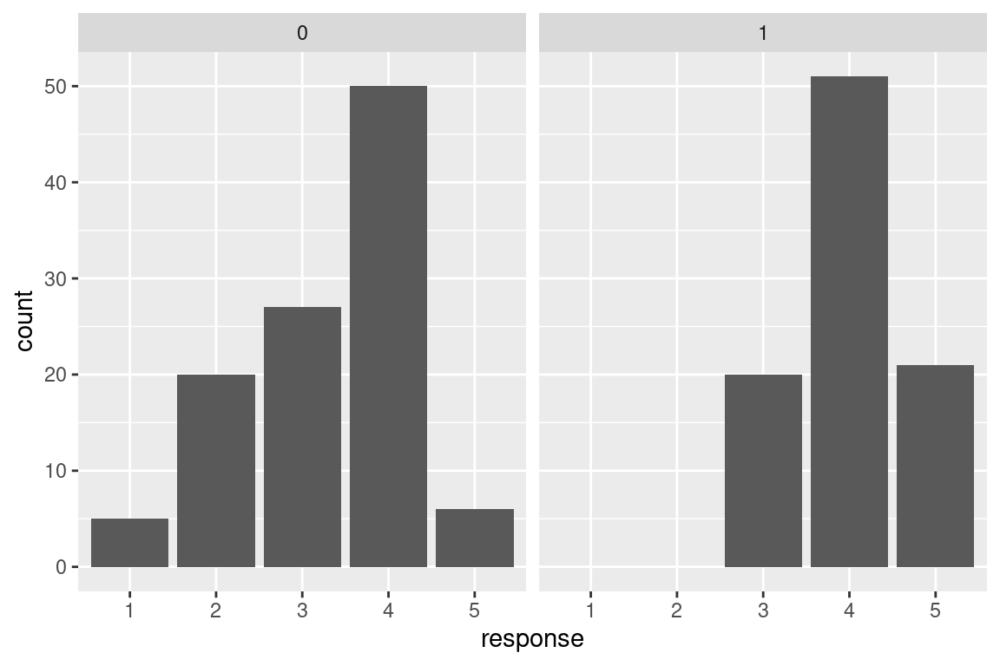
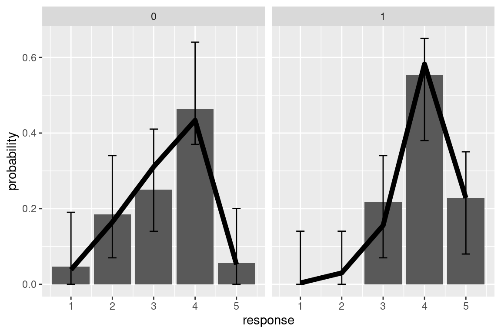
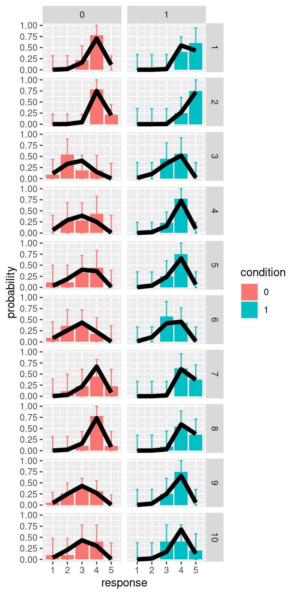

# Models for ordinal data {#ordinal}

Ordinal-type of variable arise often in psychology. One common example are responses to Likert scales. Although it is very common practice that these are analyzed with a linear model, it is know that this approach can lead to serious inference errors [@Liddell2018]. For this reason, the recommended approach is to use a model appropriate for ordinal data. Here I will describe an approach to this, using an ordered logistic regression model (also know as proportional odds model). 

## Ordered logistic regression

One way to think about this model is by assuming the existence of a continuous latent quantity, call it $y$, specified by a logistic probability density function. The latent distribution is partitioned into a series of $k$ intervals, where $k$ is the number of ordered choice options available to respondents, using $k+1$ latent cut-points, $c_1, \ldots, c_{k+1}$. By integrating the latent density function within each interval we obtain the ordinal response probabilities $p_1, \ldots, p_k$. Other choices are possible (e.g. assuming a normally distributed latent variable would yield an ordered _probit_ model). Beyond mathematical convenience, one advantage of the ordered logit is that coefficient can be interpreted as ordered log-odds, implementing the proportional odds assumption [@McCullagh1980].

Formally, the model can be notated as

$$
\begin{aligned}
p_k & = p\left(c_{k-1} < y \le c_k \mid \mu \right)\\
 & = \text{logit}^{-1}\left(c_k - \mu \right) - \text{logit}^{-1}\left(c_{k-1} - \mu \right)
\end{aligned}
$$

where 
$$
\text{logit}^{-1}(\alpha) = \frac{1}{1+e^{-\alpha}}
$$
is the cumulative function of the logistic distribution (also known as inverse-logit), and
$$
\mu = \beta_1 x_1 + \ldots + \beta_n x_n
$$
is the linear part of the model (a linear combination of the $n$ predictor variables).


This is the general approach and the formalism used - below I present few examples that illustrates how this work in practice in R.


### Mixed-effects ordinal regression

R libraries used in this example


``` r
library(ggplot2)
library(ordinal)
library(tidyverse)
library(DescTools)
```

In addition to the above libraries, here I will create a handy R function that gives the probabilities of the categorical responses given a mean value of the latent quantity (indicated with $\mu$ above) and a set of cutpoints $c_1, \ldots, c_{k+1}$. This will be used both for simulating the data and for plotting the fit of the model.


``` r
ordered_logistic <- function(eta, cutpoints){
  cutpoints <- c(cutpoints, Inf)
  k <- length(cutpoints)
  p <- rep(NA, k)
  p[1] <- plogis(cutpoints[1], location=eta, scale=1, lower.tail=TRUE)
  for(i in 2:k){
    p[i] <- plogis(cutpoints[i], location=eta, scale=1, lower.tail=TRUE) - 
      plogis(cutpoints[i-1], location=eta, scale=1, lower.tail=TRUE)
  }
  return(p)
}
```

For this example we simulate some data. We have two predictors: `x1`, a continuous predictor that vary with each observation, and `d1` a dummy variable that indicate a categorical predictor with 2 levels (e.g. two experimental conditions). The conditions are within-subject, meaningthat each participant (identified by the variable `id`) is being tested in both conditions.


``` r
set.seed(5)
N <- 200
N_id <- 10
dat <- data.frame(
  id = factor(sample(1:N_id,N, replace = T)),
  d1 = rbinom(N,1,0.5), # dummy variable (0,1) indicate 2 conditions
  x1 = runif(n = N, min = 1, max = 10)
)
rfx <- rnorm(length(unique(dat$id)), mean=0, sd=5)
LP <- 0.5*dat$x1 + 2*dat$d1 + rfx[dat$id]
for(i in 1:N){
  dat$response[i] <- which(rmultinom(1,1, ordered_logistic(LP[i], c(0,2.5, 5,10)))==1)
}
dat$response <- factor(dat$response)
str(dat)
#> 'data.frame':	200 obs. of  4 variables:
#>  $ id      : Factor w/ 10 levels "1","2","3","4",..: 2 9 9 9 5 7 7 3 3 6 ...
#>  $ d1      : int  0 0 0 0 0 0 0 1 0 0 ...
#>  $ x1      : num  6.81 1.49 6.94 3.09 3.97 ...
#>  $ response: Factor w/ 5 levels "1","2","3","4",..: 4 1 3 2 2 3 3 4 3 2 ...
```

The dependent variable is categorical with 5 levels - here is a plot of the number of responses per category in the two conditions. We are interested in testing whether the distribution differ across the conditions.


``` r
ggplot(dat,aes(x=response))+
  geom_bar()+
  facet_grid(.~d1)
```



We use the `clmm()` function in the package `ordinal` to estimate the model. The syntax is similar to what we would use for a linear mixed effect model. Note that in the output the `Threshold coefficients` are the latent cutpoints $c_1, \ldots, c_{4}$


``` r
model <- clmm(response ~ x1 + d1 + (1|id), data = dat)
summary(model)
#> Cumulative Link Mixed Model fitted with the Laplace approximation
#> 
#> formula: response ~ x1 + d1 + (1 | id)
#> data:    dat
#> 
#>  link  threshold nobs logLik  AIC    niter    max.grad
#>  logit flexible  200  -175.75 365.49 291(919) 6.57e-05
#>  cond.H 
#>  8.6e+02
#> 
#> Random effects:
#>  Groups Name        Variance Std.Dev.
#>  id     (Intercept) 4.224    2.055   
#> Number of groups:  id 10 
#> 
#> Coefficients:
#>    Estimate Std. Error z value Pr(>|z|)    
#> x1  0.55685    0.07516   7.409 1.27e-13 ***
#> d1  2.29521    0.36658   6.261 3.82e-10 ***
#> ---
#> Signif. codes:  
#> 0 '***' 0.001 '**' 0.01 '*' 0.05 '.' 0.1 ' ' 1
#> 
#> Threshold coefficients:
#>     Estimate Std. Error z value
#> 1|2  -2.1850     0.8512  -2.567
#> 2|3   0.2853     0.7664   0.372
#> 3|4   2.9453     0.8059   3.655
#> 4|5   7.8126     1.0072   7.757
```

There is no function that can out-of the box calculate the predictions of the model for us, so this will need some coding. I also use the library `DescTools` to calculate simultaneous multinomial confidence intervals. In the resulting plot the black line are model fit, and bar the observed responses.


``` r
# pre-allocate a matrix to store model predictions
# note that these are a vector of 5 probabilities for each trial
pred_mat <- matrix(NA, nrow=N, ncol=length(unique( dat$response)))

for(i in 1:N){
  
  # first calculate the linear predictor 
  # by summing all variable as indicated
  # in the model formulate, weighted by the coefficients
  eta <- dat$x1[i]*model$beta['x1'] +  dat$d1[i]*model$beta['d1'] + model$ranef[dat$id[i]]
  # note that + model$ranef[dat$id[i]] adds 
  # the random intercept for the subjects of observation i
  
  # calculate vector of predicted probabilities
  pred_mat[i,] <- ordered_logistic(eta, model$Theta)
  
}

# add predictions to dataset
pred_dat <- data.frame(pred_mat)
colnames(pred_dat) <- paste("resp_",1:ncol(pred_mat),sep="")
pred_dat <- cbind(dat, pred_dat)

# in order to visalize the predictions, 
# we first average them for each condition
pred_dat %>%
  pivot_longer(cols=starts_with("resp_"), 
               names_prefix="resp_",
               values_to = "prob",
               names_to ="response_category") %>%
  group_by(d1, response_category) %>%
  summarise(prob = mean(prob),
            n=sum(response==response_category)) %>%
  group_by(d1) %>%
  mutate(prop_obs = n/sum(n),
    response=as.numeric(response_category)) -> pred_d1
#> `summarise()` has grouped output by 'd1'. You can override
#> using the `.groups` argument.
```

``` r

# cimpute the multinomial interval
pred_d1$CI_lb <- MultinomCI(pred_d1$n)[,"lwr.ci"] *2 
pred_d1$CI_ub <- MultinomCI(pred_d1$n)[,"upr.ci"] *2
# note that I multiply for 2 because in the plot each condition 
# will be in a different panel and the probability will sum to 1 in each panel

# visualize (aggregated) ordinal response & prediction
# the black line are the predictions of the model

ggplot(pred_d1,aes(x=response, y=prop_obs))+
  geom_col()+
  geom_errorbar(data=pred_d1, aes(ymin=CI_lb, ymax=CI_ub),width=0.2)+
  facet_grid(.~d1)+
  geom_line(data=pred_d1, aes(y=prob), size=2)+
  labs(y="probability")
#> Warning: Using `size` aesthetic for lines was deprecated in ggplot2
#> 3.4.0.
#> ℹ Please use `linewidth` instead.
#> This warning is displayed once every 8 hours.
#> Call `lifecycle::last_lifecycle_warnings()` to see where
#> this warning was generated.
```



We can repeat the same process also for calculating predictions for individual participants


``` r
# split by ID
pred_dat %>%
  pivot_longer(cols=starts_with("resp_"), 
               names_prefix="resp_",
               values_to = "prob",
               names_to ="response_category") %>%
  group_by(id, d1, response_category) %>%
  summarise(prob = mean(prob),
            n=sum(response==response_category)) %>%
  group_by(d1, id) %>%
  mutate(prop_obs = n/sum(n),
         response=as.numeric(response_category))  -> pred_d1
#> `summarise()` has grouped output by 'id', 'd1'. You can
#> override using the `.groups` argument.
```

``` r

# calculate multinomial CI
# we do a loop over all participants and conditions
pred_d1$CI_lb <- NA
pred_d1$CI_ub <- NA
for(i in unique(pred_d1$id)){
  for(cond in c(0,1)){
    pred_d1$CI_lb[pred_d1$id==i & pred_d1$d1==cond] <- DescTools::MultinomCI(pred_d1$n[pred_d1$id==i & pred_d1$d1==cond])[,"lwr.ci"] 
    pred_d1$CI_ub[pred_d1$id==i & pred_d1$d1==cond] <- DescTools::MultinomCI(pred_d1$n[pred_d1$id==i & pred_d1$d1==cond])[,"upr.ci"]
  }
}

pred_d1 %>%
  mutate(condition = factor(d1)) %>%
  ggplot(aes(x=response, y=prop_obs, fill=condition))+
    geom_col()+
    geom_errorbar(aes(ymin=CI_lb, ymax=CI_ub, color=condition), width=0.2)+
    facet_grid(id~d1)+
    geom_line(aes(y=prob), size=2)+
    labs(y="probability")
```




