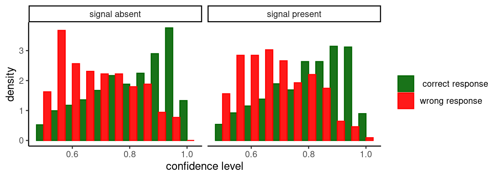
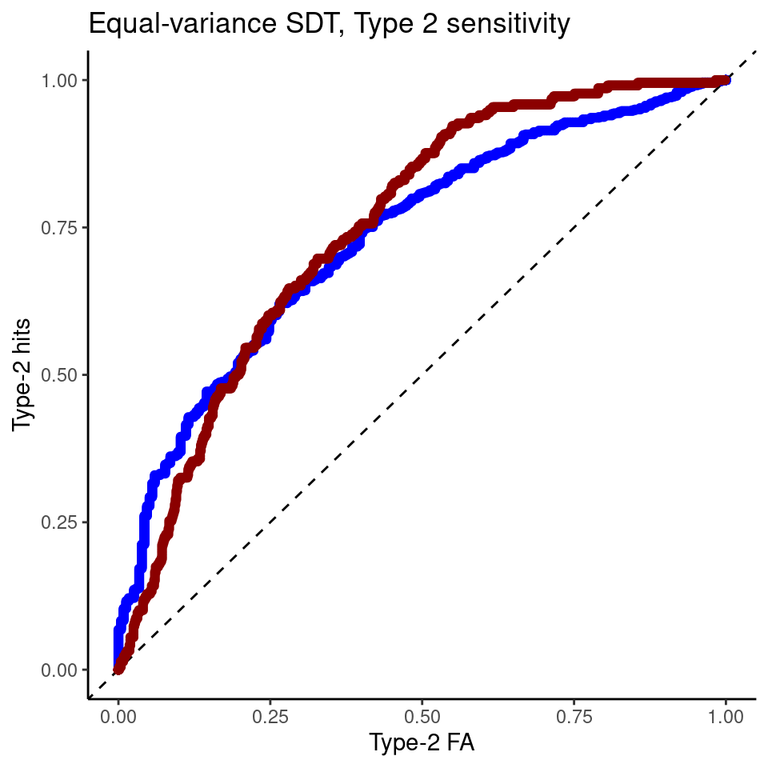
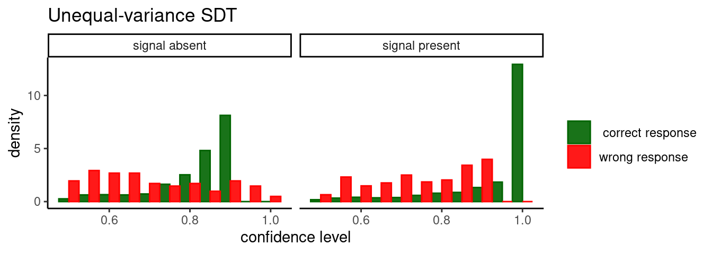

# Signal Detection Theory {#SDT}


Signal Detection Theory (hereafter abbreviated as SDT) is probably the most important and influential framework for modelling perceptual decisions in forced-choice tasks, and has wide applicability also beyond purely perceptual decision tasks. Here I review and derive some fundamental concepts of equal-variance and unequal variance signal detection theory, and present some R code to simulate the confidence of an optimal observer/decision-maker.

## Equal-variance Gaussian SDT

SDT relies on the idea that information available to the observer / decision-maker can be modeled as a single random variable on a latent decision space. SDT is typically (but not only) applied to detection tasks: each trials a stimulus is presented, consisting of some background noise with or without a signal. The observer is tasked with deciding whether the signal was present or absent (thus there are 2 possible responses, _yes_ and _no_). SDT assumes that in each trial the observer makes their decision on the basis of a random variable, call it $X$, which may be drawn from the signal distribution or from the noise distribution.

In the simplest case, the signal distribution is a Gaussian with variance $\sigma^2=1$ and mean $d'>0$.

$$
\begin{aligned}
f_S(x)&=\frac{1}{\sigma\sqrt{2 \pi}} e^{-\frac{(x-d')^2}{2 \sigma^2}}\\
&=\frac{1}{\sqrt{2 \pi}} e^{-\frac{(x-d')^2}{2}}
\end{aligned}
$$

And the noise distribution is a second normal distribution with mean $0$ and variance $\sigma^2=1$

$$
f_N(x)=\frac{1}{\sqrt{2 \pi}} e^{-\frac{x^2}{2}}
$$

Note that the _prior probability_ of signal and noise may not be equal. Let's define the probability of a signal-present trial as $p(S)=\alpha$; we have thus that $p(N)=1-p(S)=1-\alpha$.

### Optimal decision rule

The optimal way to decide whether a particular value of $x$ was drawn from a signal or noise distribution is by using a likelihood-ratio, that is one should responde "yes" whenever

$$
\begin{aligned}
\frac{f_S(x)\,p(S)}{f_N(x) \, p(N)} & \ge 1 \\
\frac{f_S(x)\,\alpha}{f_N(x) \, (1-\alpha)} & \ge 1 
\end{aligned}
$$

With some algebraic manipulations, it can be shown that the likelihood ratio decision rule amounts to comparing the value of $x$ to a criterion $c$:

$$
\begin{aligned}
\frac{f_S(x)\alpha}{f_N(x)(1-\alpha)} & \ge 1 \\
\frac{f_S(x)}{f_N(x)} & \ge \frac{1-\alpha}{\alpha} \\
\frac{\frac{1}{\sqrt{2 \pi}} e^{-\frac{(x-d')^2}{2}}}{\frac{1}{\sqrt{2 \pi}} e^{-\frac{x^2}{2}}} & \ge \frac{1-\alpha}{\alpha} \\
\frac{e^{-\frac{(x-d')^2}{2}}}{e^{-\frac{x^2}{2}}} & \ge \frac{1-\alpha}{\alpha} 
\end{aligned}
$$

taking the log of both sides

$$
\begin{aligned}
 \log \left(\frac{e^{-\frac{(x-d')^2}{2}}}{e^{-\frac{x^2}{2}}} \right) & \ge \log \left(\frac{1-\alpha}{\alpha}\right) \\
  \log \left(e^{-\frac{(x-d')^2}{2}} \right) - \log \left(e^{-\frac{x^2}{2}} \right) & \ge \log \left(\frac{1-\alpha}{\alpha}\right) \\
-\frac{(x-d')^2}{2} + \frac{x^2}{2}  & \ge \log \left(\frac{1-\alpha}{\alpha}\right) \\
\frac{-x^2 -(d')^2 + 2d' x + x^2 }{2} & \ge \log \left(\frac{1-\alpha}{\alpha}\right) \\
\frac{-(d')^2 + 2d'}{2}x & \ge \log \left(\frac{1-\alpha}{\alpha}\right) \\
d'x -\frac{(d')^2}{2}& \ge \log \left(\frac{1-\alpha}{\alpha}\right) \\
d'x & \ge \log \left(\frac{1-\alpha}{\alpha}\right) + \frac{(d')^2}{2}\\
x & \ge \frac{1}{d'}\log \left(\frac{1-\alpha}{\alpha}\right)+ \frac{d'}{2}
\end{aligned}
$$

The optimal criterion is thus found as $c = \frac{1}{d'}\log \left(\frac{1-\alpha}{\alpha}\right)+ \frac{d'}{2}$. Whenever the $x$ exceed the criterion, $x \ge c$, the observer should respond "signal present" and respond "signal absent" otherwise.

It is easy to verify that when the signal and noise trials are equiprobable, that is $p(s) = p(N) \implies \alpha=0.5$, the optimal criterion becomes $c=\frac{d'}{2}$.


---

#### Visualizing signal detection theory in R

We use R to verify visually that the optimal criterion (represented by the vertical red line) is located at horizontal coordinates of the crossover point of the two probability densities:


```r
# settings
d_prime <- 2
sigma <- 1   
alpha <- 0.5

# support of random variable X (for plotting)
supp_x <- seq(-2,4,length.out=500) 

# calculate optima criterion
optimal_c <- 1/d_prime * log((1-alpha)/alpha) + d_prime/2

# calculate probability density and scale by prior probability
fS <- alpha*dnorm(supp_x, mean=d_prime, sd=sigma)
fN <- (1-alpha)*dnorm(supp_x, mean=0, sd=sigma)

# plot 
plot(supp_x, fS, type="l",lwd=2,col="black",xlab="X",ylab="p(X)")
lines(supp_x, fN, lwd=2,col="dark grey")
abline(v=optimal_c,lwd=1.5,lty=1,col="red")
legend("topleft",c(expression("f"["S"]),expression("f"["N"])),col=c("black","dark grey"),lwd=2,title = "source:",bty="n")
```


(Note that the noise distribution, in dark grey, is centered on zero. The signal distribution is centered on $d'$.)


What if we have unequal prior probabilities, e.g. $p(S)=\alpha=0.8$ ?

The optimal criterion is always at the crossover point, which however is in a different location since the two distribution are scaled by their prior proability.


```r
# Set a different prior probability
alpha <- 0.8

# calculate optima criterion
optimal_c <- 1/d_prime * log((1-alpha)/alpha) + d_prime/2

# calculate probability density and scale by prior probability
fS <- alpha*dnorm(supp_x, mean=d_prime, sd=sigma)
fN <- (1-alpha)*dnorm(supp_x, mean=0, sd=sigma)

# plot 
plot(supp_x, fS, type="l",lwd=2,col="black",xlab="X",ylab="p(X)")
lines(supp_x, fN, lwd=2,col="dark grey")
abline(v=optimal_c,lwd=1.5,lty=1,col="red")
legend("topleft",c(expression("f"["S"]),expression("f"["N"])),col=c("black","dark grey"),lwd=2,title = "source:",bty="n")
```


---

### Estimating the parameters from data

The parameters can be easily estimated form the proportions of hits, $p_\text{H}$, and false alarms $p_{\text{FA}}$. (Hits are correct 'yes' responses and faalse alarms are incorrect 'yes' responses.)

Consider first that the probability of a false alarm is just the probability of observing $X \ge c$ when $X$ is drawn from the noise distribution $f_N$.

Thus

$$
p_{\text{FA}} =  1 - \Phi(c)
$$
where $\Phi$ is the cumulative distribution function of the standard normal distribution It words, $\Phi(c)$ is the area that lies to the left of $c$ and under a Gaussian function with mean $0$ and variance $1$. 

Similarly when $X$ is drawn from the signal distribution, the probability of a hit response is the probability that a $x$ drawn from the signal distribution $f_S$ is greater than the criterion $c$,
$$
p_{\text{H}} =  1 - \Phi(c - d')
$$
Thus, if we know the proportion of hits and false alarms, we can estimate $c$ and $d'$ using the inverse of $\Phi$, which can be notated as $\Phi^{-1}$ and its often referred to as the _quantile function_

$$
c = \Phi^{-1}\left(1 -  p_{\text{FA}}\right) = - \Phi^{-1}\left(p_{\text{FA}}\right) \\
d' = c - \Phi^{-1}\left(1 -  p_{\text{H}}\right) =\Phi^{-1}\left(p_{\text{H}}\right) - \Phi^{-1}\left(p_{\text{FA}}\right) 
$$


---

### GLM formulation of equal-variance SDT models

Note that the above SDT model could be reformulated a _probit_ generalized linear model. This could be expressed as 

$$
\Phi^{-1}(p_{\text{yes}}) = \beta_0 + \beta_1 x
$$
where $p_{\text{yes}}$ is the probability of the observer responding that the signal was present, and $x$ is a variable that indicates the presence/absence of the signal as 1/0, respectively. The similarity with the SDT model is evident if we consider that, in the GLM, the probability of a hit or a false alarm correspond to $p_{\text{yes}}$ when the signal is present (that is $x=1$) or absent (that is $x=0$), respectively. This allows mapping the signal detection theory parameters, $d'$ and $c$ to the GLM intercept and slope parameters, $\beta_0$ and $\beta_1$

$$
c = -\Phi^{-1}(p_{\text{FA}}) = - \beta_0
$$
and 

$$
d' = \Phi^{-1}(p_{\text{H}}) - \Phi^{-1}(p_{\text{FA}}) = \beta_0 + \beta_1 -\beta_0 = \beta_1
$$
Recognizing this identity makes it easier to use statistical packages such as R to easily analyse complex design with multiple conditions and interaction effects. It also makes it possible to estimate multi-level (or hierarchical, random-effects) SDT models.


## Bayesian confidence in equal-variance SDT

Formally, confidence should be the Bayesian (that is, subjective) posterior probability that a decision was correct given the evidence available to the observer.

First some notation. Let's use $S$ to indicate the event that a signal was present (an event is something to which we can assign a probability) and $N$ to indicate the event that only noise was presented. Say the observer respond yes, their confidence should correspond to the posterior probability $p(S\mid x)$, that is the probability that a signal was present given that we observed $x$.

This can be calculated applying Bayes theorem:


$$
\begin{aligned}
p(S \mid x) & = \frac{p(x \mid S)\times p(S)}{p(x)} \\
& = \frac{p(x \mid S) p(S)}{p(x \mid S) p(S)+p(x \mid N) p(N)} \\
& = \frac{p(x \mid S) \alpha}{p(x \mid S) \alpha+p(x \mid N) (1-\alpha)}
\end{aligned}
$$

This can be simplified further in cases where we have equal probabilities $p(s) = p(N) \implies \alpha=0.5$
$$
p(S \mid x)_{\alpha=0.5} =  \frac{p(x \mid S)}{p(x \mid S)+p(x \mid N)}
$$

Note also that the confidence for the _signal absent_ trials $N$ is calculated in the same way:

$$
p(N \mid x)_{\alpha=0.5} =  \frac{p(x \mid S)}{p(x \mid N)+p(x \mid N)}
$$

One question we may ask at this point is how the distribution of confidence levels of the observers changes in correct vs wrong responses, and also in signal absent vs signal present responses. The simplest way to get at this is by simulation - see the following R code


```r
# load ggplot library for plotting
library(ggplot2)

# settings
d_prime <- 1.5
sigma <- 1   
alpha <- 0.5

# calculate optimal criterion
optimal_c <- 1/d_prime * log((1-alpha)/alpha) + d_prime/2

# simulate 2*10^4 trials and calculate the confidence 
N_trials <- 2*10^3
tar_pres <- c(rep(0,N_trials/2),rep(1,N_trials/2))

# simulate X by adding Gaussian noise (function rnorm())
x <- tar_pres*d_prime + rnorm(length(tar_pres), mean=0, sd=1)
resp_yes <- ifelse(x >= optimal_c,1,0)

# define a custom function to calculate confidence
confidenceSDT1 <- function(x,resp,d_prime, alpha=0.5){
  conf <- ifelse(
    resp==1,
    dnorm(x,mean=d_prime,sd=1)/(dnorm(x,mean=d_prime,sd=1)+dnorm(x,mean=0,sd=1)),
    dnorm(x,mean=0,sd=1)/(dnorm(x,mean=d_prime,sd=1)+dnorm(x,mean=0,sd=1))
  )
  return(conf)
}

# calculate confidence
confidence <- confidenceSDT1(x, resp_yes, d_prime=1.5)

# put into a dataframe for plotting
d <- data.frame(confidence, x, tar_pres, resp_yes)

# check which simulated responses are correct
d$correct <- ifelse((d$tar_pres==1 & d$resp_yes==1)|(d$tar_pres==0 & d$resp_yes==0),1,0)

# plot
d$tar <- ifelse(d$tar_pres==1,"signal present","signal absent")
d$correct <- ifelse(d$correct==1," correct response","wrong response")
ggplot(d,aes(x=confidence,group=correct,color=correct,fill=correct))+
  geom_histogram(position = 'dodge',aes(y=..density..), binwidth=0.05,alpha=0.9)+
  facet_grid(.~tar)+
  scale_color_manual(values=c("dark green","red"),name="")+
  scale_fill_manual(values=c("dark green","red"),name="")+
  labs(x="confidence level")+
  theme_classic()
#> Warning: The dot-dot notation (`..density..`) was deprecated in ggplot2 3.4.0.
#> ℹ Please use `after_stat(density)` instead.
#> This warning is displayed once every 8 hours.
#> Call `lifecycle::last_lifecycle_warnings()` to see where this warning was generated.
```



The distribution of confidence is - as expected - different from correct and wrong response: it is peaked near 1 for correct responses, and peaked near 0.5 for errors. Importantly, the separation between confidence distributions in correct and wrong responses is similar in both signal absent (left panel) and signal present (right panel) trials. This suggest that metacognitive sensitivity - the ability to discriminate between correct and incorrect responses - should not change across signal present and signal absent answers. This can be visualized with Type-2 ROC (Receiver Operating Characteristic) curves, which are obtained by plotting the proportion of "type-2 hits" as a function of the "type-2 false alarms" - these are the fraction of correct and wrong responses that are classified as correct for each possible
threshold setting on the confidence distribution. The term "Type-2" is used to indicate that is a metacognitive task - a decision about a decision[@Galvin2003]. 


```r
# functions to compute true and false positive rates
TPR <- function(d,th){ sum(d$tar_pres==1 & d$x>th) / sum(d$tar_pres==1)}
FPR <- function(d,th){ sum(d$tar_pres==0 & d$x>th) / sum(d$tar_pres==0)}

# use all the sorted values are possible threshods
thresholds <- sort(d$x)

roc <- data.frame(y=sapply(thresholds, function(th){TPR(d[d$resp_yes==1,],th)}), 
                 x=sapply(thresholds, function(th){FPR(d[d$resp_yes==1,],th)}) )

roc0 <- data.frame(y=sapply(thresholds, function(th){TPR(d[d$resp_yes==0,],th)}), 
                 x=sapply(thresholds, function(th){FPR(d[d$resp_yes==0,],th)}) )

ggplot(roc,aes(x,y))+geom_point(color="blue")+theme_classic()+labs(y="Type-2 hits", x="Type-2 FA") +geom_abline(intercept=0,slope=1,lty=2)+geom_point(data=roc0,color="dark red")+ggtitle("Equal-variance SDT, Type 2 sensitivity")
```



The ROC curve derived from confidence ratings discriminate equally well correct vs wrong responses (in the plot, blue is the curve for target present responses) - thus indicating similar metacognitive or "type-2" sensitivity. However, empiricaly it has been found that metacognitive sensitivite seems to be worse for signal absent responses - e.g. see [@Mazor2020]. As we see below, this finding can be accomodated by relaxing the assumption that signal and noise distribution have the same standard deviation, and assuming instead that the standard deviation of the signal present distribution is larger.


---

## Unequal-variance SDT

Signal detection theory can be extended to account for cases in which signal and noise distribution have a different variance. For many types of random processes, the mean and the variance are related such that signals with higher mean have also higher variance (the firing rate of neurons is an example). Thus the signal distribution is now given by

$$
f_S(x)=\frac{1}{\sigma\sqrt{2 \pi}} e^{-\frac{(x-d')^2}{2 \sigma^2}}
$$

with the variance $\sigma^2 \ne 1$.

One important consequence of the different noise level, is that now the log-likelihood ratio is a quadratic function of the signal x

$$
\log \left( \frac{f_S(x)}{f_N(x)} \right) = -\frac{1}{2 \sigma^2} \left[\left(1 - \sigma^2 \right)x^2 -2d' x + d'^2 + 2\sigma^2 \log \sigma\right]
$$
As a result, the log-likelihood ratio crosses zero in 2 points, thus yielding 2 decision criteria - see next figure.


```r
# settings
d_prime <- 3
sigmaS <- 2  
sigmaN <- 1 # fixed
alpha <- 0.5


# calculate optimal UEV-SDT criterion
UVGSDTcrit <- function(dp, sig, logbeta=0){
  TwoSigSq <- 2 * sig^2
  
  minLam <- optimize(function(X, dp, sig){-((1 - sig^2) * X^2 - 2 * dp * X + dp^2 + TwoSigSq * log(sig))/TwoSigSq}, c(-10, 10), dp = dp, sig = sig)$objective
  
  if(logbeta < minLam){ warning("complex roots")}
  
  cf <- -c(dp^2 + TwoSigSq * log(sig) + logbeta * TwoSigSq,-2 * dp, 1 - sig^2)/TwoSigSq
  
  proot <- polyroot(cf)
  
  return(sort(Re(proot)))
}

#
UE_c <- UVGSDTcrit(d_prime, sigmaS)

# simulate 2*10^3 trials and calculate the confidence 
N_trials <- 2*10^3
tar_pres <- c(rep(0,N_trials/2),rep(1,N_trials/2))

# simulate X by adding Gaussian noise (function rnorm())
# first generate internal responses
x <- rep(NA,length(tar_pres))
x[tar_pres==0] <- rnorm(N_trials/2, mean=0,sd=1)
x[tar_pres==1] <- rnorm(N_trials/2, mean=d_prime,sd=sigmaS)


# plot unequal variance and criterion
Xi <- seq(-6,10,length.out=500)
fS = dnorm(Xi,mean=d_prime,sd=sigmaS)
fN = dnorm(Xi,mean=0,sd=1)
plot(Xi,fN,type="l",col="grey",lwd=3,ylab="density",xlab="X")
lines(Xi,fS,lwd=3)
abline(v=UE_c,col="red",lwd=2)
```


The reason why there are two criteria may be seen more clearly if we plot the logarithm of the probability density, as this makes it evident that there are two regions, to the left and the right of the noise distribution, in which the probability of signal present is larger than that of no-signal (i.e noise only).


```r
# plot unequal variance and criterion
Xi <- seq(-6,10,length.out=500)
fS = dnorm(Xi,mean=d_prime,sd=sigmaS)
fN = dnorm(Xi,mean=0,sd=1)
plot(Xi,fN,type="l",col="grey",lwd=3,ylab="density",xlab="X", log="y")
lines(Xi,fS,lwd=3)
abline(v=UE_c,col="red",lwd=2)
```


### Optimal confidence in unequal-variance SDT

The confidence can be computed in the same way (applying Bayes rule).


```r
# now apply decision rule
if(length(UE_c)==1){
  resp_yes <- ifelse(x > UE_c,1,0)
}else{
  resp_yes <- ifelse((x <= UE_c[1])|(x>UE_c[2]),1,0)
}


# define a custom function to calculate confidence
confidenceSDT1 <- function(x,resp,dp=d_prime, alpha=0.5){
  conf <- ifelse(
    resp==1,
    dnorm(x,mean=dp,sd=sigmaS)/(dnorm(x,mean=dp,sd=sigmaS)+dnorm(x,mean=0,sd=1)),
    dnorm(x,mean=0,sd=1)/(dnorm(x,mean=dp,sd=sigmaS)+dnorm(x,mean=0,sd=1))
  )
  return(conf)
}

# calculate confidence
confidence <- confidenceSDT1(x, resp_yes)

# put into a dataframe for plotting
d <- data.frame(confidence, x, tar_pres, resp_yes)

# check which simulated responses are correct
d$correct <- ifelse((d$tar_pres==1 & d$resp_yes==1)|(d$tar_pres==0 & d$resp_yes==0),1,0)

# plot
d$tar <- ifelse(d$tar_pres==1,"signal present","signal absent")
d$correct <- ifelse(d$correct==1," correct response","wrong response")
ggplot(d,aes(x=confidence,group=correct,color=correct,fill=correct))+
  geom_histogram(position = 'dodge',aes(y=..density..), binwidth=0.05,alpha=0.9)+
  facet_grid(.~tar)+
  scale_color_manual(values=c("dark green","red"),name="")+
  scale_fill_manual(values=c("dark green","red"),name="")+
  labs(x="confidence level")+
  theme_classic()+
  ggtitle("Unequal-variance SDT")
```



As can be seen from the ROC curve, confidence levels (even estimated optimally using Bayes rule) reveals an asymmetry (again, target present responses are represented by the blue curve). That is, the unequal-variance signal detection theory model predict worse metacognitive sensitivity for "signal absent" responses.


```r
# functions to compute true and false positive rates
TPR <- function(d,th){ sum(d$tar_pres==1 & d$x>th) / sum(d$tar_pres==1)}
FPR <- function(d,th){ sum(d$tar_pres==0 & d$x>th) / sum(d$tar_pres==0)}

# use all the sorted values are possible threshods
thresholds <- sort(d$x)

roc <- data.frame(y=sapply(thresholds, function(th){TPR(d[d$resp_yes==1,],th)}), 
                 x=sapply(thresholds, function(th){FPR(d[d$resp_yes==1,],th)}) )

roc0 <- data.frame(y=sapply(thresholds, function(th){TPR(d[d$resp_yes==0,],th)}), 
                 x=sapply(thresholds, function(th){FPR(d[d$resp_yes==0,],th)}) )

ggplot(roc,aes(x,y))+geom_point(color="blue")+theme_classic()+labs(y="Type-2 hits", x="Type-2 FA") +geom_abline(intercept=0,slope=1,lty=2)+geom_point(data=roc0,color="dark red")+ggtitle("Unequal-variance SDT, Type 2 sensitivity")
```


