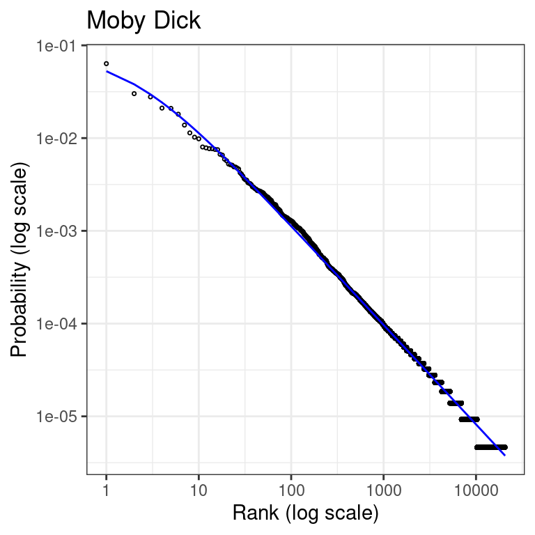

# Fitting Zipf's law to word frequency data


Zipf's law predicts that the frequency of any word is inversely proportional to its rank in the frequency table. This phenomenon is observed across many natural languages and can be described by the Zipf-Mandelbrot law. Here I demonstrate how to apply maximum likelihood estimation and the binomial split approach, as described by Piantadosi [@PiantadosiZipf], to fit Zipf's law to the word frequency data of "Moby Dick".

## Background

Zipf's law can be mathematically represented as:

$$ P(r) \propto \frac{1}{r^a} $$

where \(P(r)\) is the probability of the \(r\)-th most common word, and \(a\) is a parameter that typically lies close to 1 for natural language.

An extension of this is the Zipf-Mandelbrot law, which introduces a parameter \(s\) to account for a finite-size effect:

$$ P(r) \propto \frac{1}{(r+s)^a} $$

where \(s\) is a positive parameter that shifts the rank.

## Data preparation

We use the word frequency data from "Moby Dick" available in the `languageR` package. First, we load and clean the data:


``` r
# Clean environment and set working directory
rm(list=ls())

# Load necessary libraries
library(tidyverse)
#> ── Attaching core tidyverse packages ──── tidyverse 2.0.0 ──
#> ✔ dplyr     1.1.4     ✔ readr     2.1.5
#> ✔ forcats   1.0.0     ✔ stringr   1.5.1
#> ✔ ggplot2   3.5.1     ✔ tibble    3.2.1
#> ✔ lubridate 1.9.3     ✔ tidyr     1.3.1
#> ✔ purrr     1.0.2     
#> ── Conflicts ────────────────────── tidyverse_conflicts() ──
#> ✖ dplyr::filter() masks stats::filter()
#> ✖ dplyr::lag()    masks stats::lag()
#> ℹ Use the conflicted package (<http://conflicted.r-lib.org/>) to force all conflicts to become errors
```

``` r
library(languageR)

# Load and prepare Moby Dick word frequency data
data(moby)
words <- moby[which(moby != "")]

# create a table with word frequencies
word_freq <- table(words)
word_freq_df <- as.data.frame(word_freq, stringsAsFactors=FALSE)
names(word_freq_df) <- c("word", "frequency")
head(word_freq_df)
#>       word frequency
#> 1        -         3
#> 2    -west         1
#> 3  -wester         1
#> 4 -Westers         1
#> 5       [A         1
#> 6  [SUDDEN         1
```

We then rank the words by frequency 


``` r
ranked_words <- word_freq_df %>%
  arrange(desc(frequency)) %>%
  mutate(word = factor(word, levels = word),
         rank = rank(-frequency, ties.method = "random"))
```

## Estimation

We define custom functions for the binomial split, the negative log-likelihood, and the Zipf–Mandelbrot law probability mass function:


``` r
# Binomial split - randomly split the corpus to ensure independence of rank and frequencies estimates
binomial_split <- function(data, p=0.5){
  f1 <- rep(NA, nrow(data))
  f2 <- rep(NA, nrow(data))
  for(i in 1:nrow(data)){
    f1[i] <- rbinom(1, size=data$frequency[i], prob=p)
    f2[i] <- data$frequency[i] - f1[i] 
  }
  data_split <- data.frame(
    word = data$word,
    frequency = f1,
    rank = rank(-f2, ties.method = "random")
  )
  return(data_split)
}

# negative log-likelihood function (for optimization)
neglog_likelihood <- function(params, data) {
  s <- params[1]
  a <- params[2]
  
  N <- length(data$frequency)
  M <- sum(data$frequency)
  logP_data <- M*log(sum(((1:N)+s)^(-a)))+a*sum(data$frequency[data$rank]*log(data$rank+s))
  return(logP_data)
}

# probability mass function for Zipf–Mandelbrot law
# as defined in: https://en.wikipedia.org/wiki/Zipf%E2%80%93Mandelbrot_law
dzipf <- function(rank, params, N){
  s <- params[1]
  a <- params[2]
  p <- ((rank + s)^(-a))/(sum((rank + s)^(-a)))
  return(p)
}
```

We then fit the model using the `optim` function:


``` r
# Initial parameter values for optimization
init_params <- c(s = 1, a = 1)

# Fitting model to the data
fit_zipf <- optim(par = init_params, 
                fn = neglog_likelihood, 
                data = ranked_words,
                method = "L-BFGS-B", 
                lower = c(0, 0),
                upper = c(100, 100),
                hessian = TRUE)
```


## Results

Here are the estimated values of the parameters \(s\) and \(a\)


``` r
print(fit_zipf$par)
#>        s        a 
#> 1.817667 1.072602
```

We can get standard errors of the parameters estimates from the Hessian matrix:


``` r
sqrt(diag(solve(fit_zipf$hessian)))
#>           s           a 
#> 0.032707787 0.001272293
```

Note that these standard errors do not take into account the additional sampling variability due to the binomial split. In order to take this into account we can re-estimate the model for multiple random splits, and examine how much parameters vary across spits.


## Visualization

Finally, we can visualize the fitted model against the actual data in the classical rank-frequency plot:


``` r
#computed predicted probabilities
ranked_words$probability_predicted <- dzipf(rank=ranked_words$rank, 
                                        params=fit_zipf$par,
                                        N=length(ranked_words$frequency))

# Make rank-frequency plot using ggplo2
ggplot() +
  geom_point(data=ranked_words, pch=21, size=0.6,
             aes(x = rank, y = frequency/sum(frequency))) +
  geom_line(data=ranked_words,
            aes(x = rank,y = probability_predicted), 
            color="blue") +
  scale_x_log10() +
  scale_y_log10() +
  theme_bw() +
  labs(
    title = "Moby Dick",
    x = "Rank (log scale)",
    y = "Probability (log scale)"
  )
```



